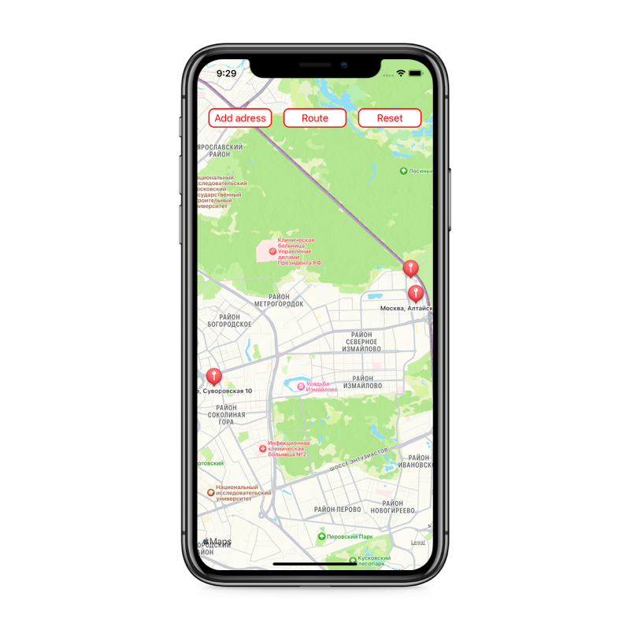

# routeMap
Test project, tha main task is to mark points on the map and calculate & show the shortest route between them.

## Stack
* UIKit
* MapKit
* SwiftLint
* SnapKit

## Screenshots
### Main screen with map
")
### Alert controller - add adress
")
### Map with pins

### The shortest route
")
